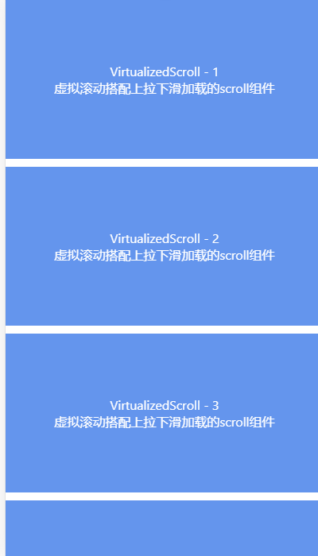

# react-virtualized-scroll
虚拟滚动搭配上拉下滑加载的scroll组件

[](https://github.com/DavidWong9785/react-virtualized-scroll)
[](https://github.com/DavidWong9785/react-virtualized-scroll/issues)
[](https://github.com/DavidWong9785/react-virtualized-scroll)
[](https://github.com/DavidWong9785/react-virtualized-scroll)<br><br>
[](https://www.npmjs.com/package/react-virtualized-scroll)
[](https://www.npmjs.com/package/react-virtualized-scroll)
[](https://www.npmjs.com/package/react-virtualized-scroll)




### 简介

- 搭配 <code style="color: #ff8080">typescript</code> 和 <code style="color: #ff8080">react-hooks</code> 编写的虚拟滚动组件
- 基于  <code style="color: #ff8080">react-virtualized</code> 进行再封装。
- 暴露了 <code style="color: #ff8080">react-virtualized</code> 的 ref，可调用 <code style="color: #ff8080">react-virtualized</code> 的方法
- 除了渲染列表，你还可以传入其他的子组件（如悬浮球~等），只需要把定位设为 fixed

### 安装导入

> cnpm i react-virtualized react-virtualized-scroll --save

> import ReactVirtualizedScroll from 'react-virtualized-scroll'

### 使用

```
    <ReactVirtualizedScroll
        onPullDown={handlePullDown}
        onPullUp={handlePullUp}
        hasMore={hasMore}
        data={data}
        row={Row}
        height={"100vh"}
        width={"100vw"}
        onScroll={onScroll}
        info={info}
        logo={logo}>
        <div style="position: fixed;top: 50%">fixed element</div>
    </ReactVirtualizedScroll>
```

### 属性
<table>
    <tr>
        <td>名称</td>
        <td>类型</td>
        <td>说明</td>
    </tr>
    <tr>
        <td style="width: 150px;text-align:center">width、height</td>
        <td>string</td>
        <td>列表宽高，带单位</td>
        <td style="width: 140px;text-align:center">
            <p style="margin-bottom: 10px">可选</p>
            <p style="margin-bottom: 0px">默认100vw/vh</p>
        </td>
    </tr>
    <tr>
        <td style="width: 150px;text-align:center">hasMore</td>
        <td>boolean</td>
        <td>判断是否还可以下滑加载</td>
        <td style="width: 140px;text-align:center;color: orange">必传，默认true</td>
    </tr>
    <tr>
        <td style="width: 150px;text-align:center">data</td>
        <td>array</td>
        <td>用于渲染列表的目标数</td>
        <td style="width: 140px;text-align:center;color: orange">必传，默认 []</td>
    </tr>
    <tr>
        <td style="width: 150px;text-align:center">info</td>
        <td>object</td>
        <td>需要传入 row 渲染函数作为参数的数据</td>
        <td style="width: 140px;text-align:center">可选</td>
    </tr>
    <tr>
        <td style="width: 150px;text-align:center">logo</td>
        <td>object</td>
        <td>加载时展示的 loading 图案，四个属性</td>
        <td style="width: 140px;text-align:center">
            <p style="margin-bottom: 10px">可选</p>
            <p style="margin-bottom: 0px">有默认logo</p>
        </td>
    </tr>
    <tr>
        <td style="width: 150px;text-align:center">onPullDown</td>
        <td>function</td>
        <td>
            <p style="margin-bottom: 10px;color: orange">
                下拉加载回调
            </p>
            <p style="margin-bottom: 10px">
                该方法必须返回一个 <code style="color: orange">promise</code> 对象 ( 用于控制下拉 loading 状态 )
            </p>
            <p style="margin-bottom: 10px">
                可以使用 <code style="color: orange">async</code> 方法或者直接返回 <code style="color: orange">promise</code> 对象
            </p>
            <p style="margin-bottom: 0">
                当 <code style="color: orange">promise</code> 状态完成之后 ( resolve/reject )，下拉加载状态结束
            </p>
        </td>
        <td style="width: 140px;text-align:center">可选</td>
    </tr>
    <tr>
        <td style="width: 150px;text-align:center">onPullUp</td>
        <td>function</td>
        <td>
            上滑加载回调，目的同上，该方法需要返回一个 <code style="color: orange">promise</code> 对象
        </td>
        <td style="width: 140px;text-align:center">可选</td>
    </tr>
    <tr>
        <td style="width: 150px;text-align:center">onScroll</td>
        <td>function</td>
        <td>
            <p style="margin-bottom: 10px;color: orange">滑动回调</p>
            <p style="margin-bottom: 10px">参数1: clientHeight</p>
            <p style="margin-bottom: 10px">参数2: scrollTop</p>
            <p style="margin-bottom: 0px">参数3: scrollHeight</p>
        </td>
        <td style="width: 140px;text-align:center">可选</td>
    </tr>
    <tr>
        <td style="width: 150px;text-align:center">row</td>
        <td>function</td>
        <td>
            <p style="margin-bottom: 10px;color: orange">列表每一行的渲染函数</p>
            <p style="margin-bottom: 10px">参数1：类型为object，属性包含该行索引 index 和自定义传入的 info 属性</p>
            <p style="margin-bottom: 0px">参数2：用于渲染列表的目标数组data</p>
        </td>
        <td style="width: 140px;text-align:center;color: orange">必传</td>
    </tr>
</table>

### logo属性（字符串，图片等等，只要是JSX.Element即可）

| 属性 | 说明 |
| ---------------- | --------------------- |
| pulldown_loading | 下拉加载 loading 的 logo |
| pulldown_success | 下拉加载 成功 的 logo |
| pullup_loading   | 上滑加载 loading 的 logo |
| pullup_success   | 上滑加载 成功 的 logo |